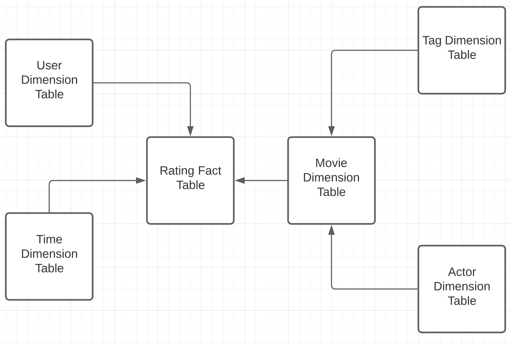
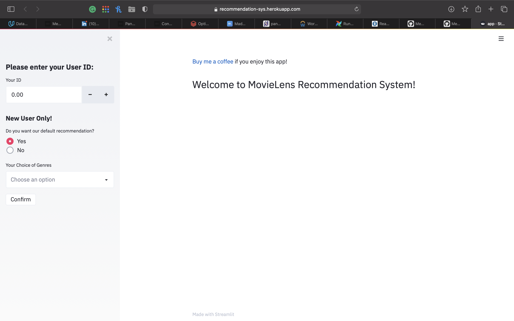

# Recommendation System Fed with Breaking News


## Overview

This project imitates a recommendation system that features breaking news. The initial data warehouse is established based on the data provided by MoviesLens Group, while there are feeds from Twitter API to update the recommendation options. All the data is stored on S3 bucket as parquets and the ETL jobs were compiled in PySpark and orchestrated by Airflow.

The recommendation works in this way: if the user ID that a user types in exists in the existing user list, I assume this is an existing user, then I provide him/her with the movies using content-based method; otherwise, it is a new user and he/she is allowed to choose the default recommendation or not. The default recommendation is to recommend the movies according to the most recent twitter news. For example, those movies that the most mentioned actors are selected. If not, users can see the results based on the genres that they choose.

This recommendation system is scalable and resilient to higher-scale data.

## Data Warehouse Architecture



## Data Sources:

- [MovieLens](https://www.kaggle.com/grouplens/movielens-20m-dataset)
- [MadeWithML](https://madewithml.com)
- Twitter API

## ETL

- Wrangle the plain data sources (csv files) into S3 bucket (parquets)
- Built the recommendation system
- Built the pipeline that transports the data from Twitter API to Data Lake
- Host the system and pipeline on Server (Heroku)

## Setup steps

1. Clone this repo and install all the required packages to your environment

   ```
   git clone https://github.com/MemphisMeng/Udacity-Capstone-Project
   pip install -r requirements.txt
   ```

2. Inside the directory, turn on the Airflow UI

   ```
   cd Udacity-Capstone-Project
   # initialize the database
   airflow db init
   
   airflow users create \
       --username admin \
       --firstname Peter \
       --lastname Parker \
       --role Admin \
       --email spiderman@superhero.org
   
   # start the web server, default port is 8080
   airflow webserver --port 8080
   
   # start the scheduler
   # open a new terminal or else run webserver with ``-D`` option to run it as a daemon
   airflow scheduler
   ```

3. On the interface of Airflow, turn on the dogs *ETL* and *twitterCollector*.

4. Run the streamlit web app using another terminal:

   ```
   streamlit run app.py
   ```

   You can check it out [here](https://recommendation-sys.herokuapp.com)!

   

## Scenarios

### The data was increased by 100x.

This change will not affect the robustness of the system. One and only change should be the replacement of Pandas. Pandas may not work well if the data is too large. One reliable option at that time will be Dask, which was designed to tackle the challenges of parallelism in analytics.

### The pipelines will be run on a daily basis by 7am every day.

- One of my pipelines (twitter collector) has been set on a hourly basis so it won't make a big difference to run them both at 7am every day if necessary. 
- Data quality operators are used at appropriate position. In case of DAG failures email triggers can be configured to let the team know about pipeline failures.
- The pipelines were hosted on cloud and nothing needs to be done manually anymore.

### The database needs to be accessed by 100+ people.

The current version cannot be accessed by more than 3 users. To enable large volume of visits, the only solution is to replace the BaaS (Backend-as-a-Service) of my web app. This is not free of charge, so I prefer not to do so until required.